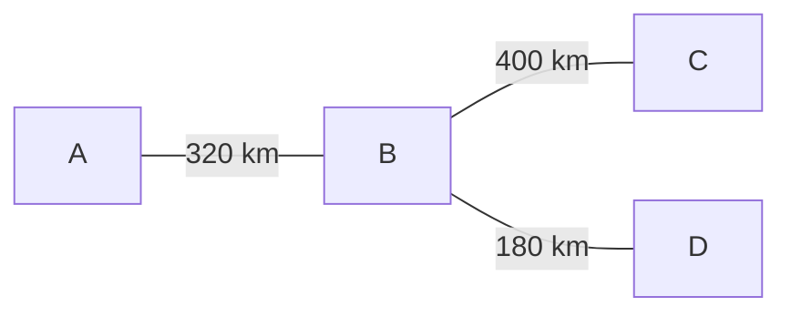
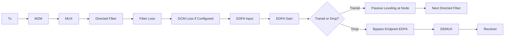
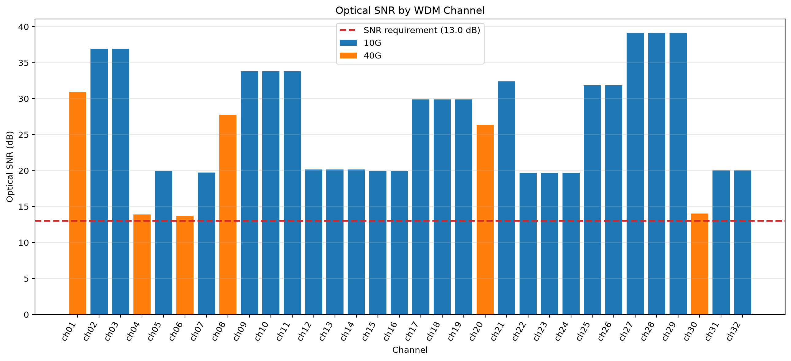
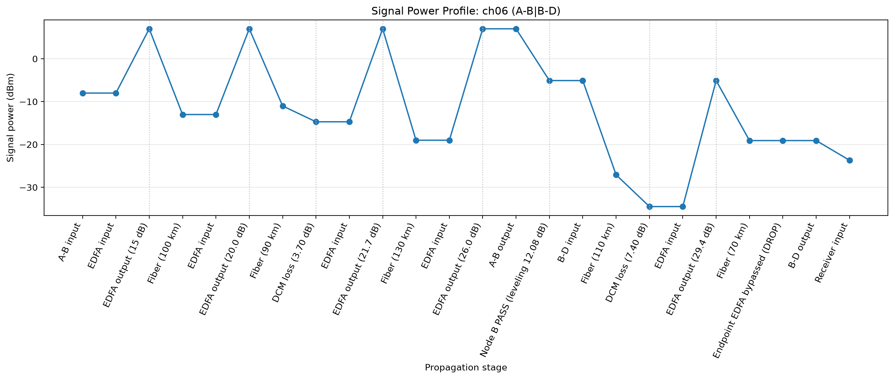
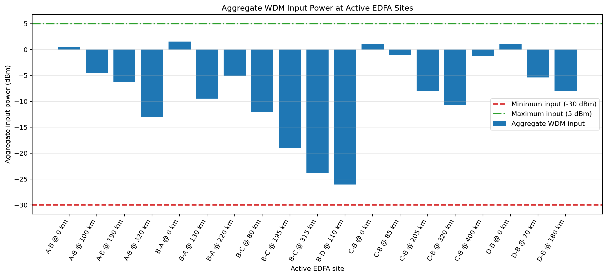
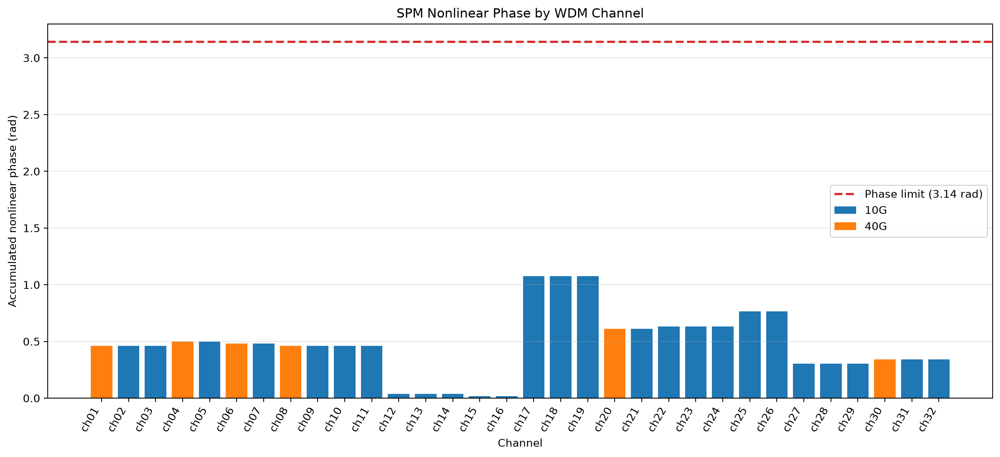

# Design and Analysis of a Four-Node Long-Haul WDM Optical Network

## 1. Project Overview

This project presents a system-level design and simulation of a four-node long-haul optical network. The goal is to satisfy a given traffic demand while completing routing and wavelength assignment, optical power-budget analysis, commercial component selection, and system-level performance validation under predefined design constraints.

The network uses 10 Gb/s and 40 Gb/s OOK channels over a wavelength-division multiplexed optical infrastructure. The simulation evaluates key system metrics including optical power, EDFA performance, ASE noise and optical SNR, nonlinear phase accumulation, and chromatic dispersion compensation.


## 2. Network Topology
The network consists of four nodes representing four cities. Node B serves as the central transit node. The physical topology is a tree structure, where all traffic between A/C/D that is not directly terminated at B must pass through node B.

Each physical connection is modeled as a bidirectional fiber pair. The link lengths are:
- A–B: 320 km
- B–C: 400 km
- B–D: 180 km



## 3. Traffic and Design Requirements

### Traffic Matrix
| From \ To(Gbps) |  A |  B |  C |  D |
| --------- | -: | -: | -: | -: |
| A         |  — | 60 | 50 | 50 |
| B         | 70 |  — | 30 | 20 |
| C         | 30 | 50 |  — | 30 |
| D         | 20 | 30 | 60 |  — |


### Key Constraints
## Commercial Components

| Component | Manufacturer / Model | Key Specifications | Role |
|---|---|---|---|
| Laser | Box Optronics DWDM DFB Butterfly Laser | CW, 2 mW output, 1528.77–1610.06 nm, ITU DWDM grid | Optical carrier source |
| 10G Modulator | Exail MX-LN-10 | LiNbO3 Mach-Zehnder intensity modulator, 10 GHz, 3.5 dB design insertion loss | 10 Gb/s OOK modulation |
| 40G Modulator | Exail MX-LN-40 | LiNbO3 Mach-Zehnder intensity modulator, 40 GHz, 3.5 dB design insertion loss | 40 Gb/s OOK modulation |
| Optical Fiber |Corning F-SMF-28 | 0.20 dB/km attenuation, 18 ps/(nm·km) dispersion, γ = 1.43 W⁻¹km⁻¹ | Long-haul transmission medium |
| EDFA | FS #35924 FMT-LA | 15–33 dB gain, 4.5 dB nominal NF, −30 to +5 dBm input range, 1528–1564 nm | Inline optical amplification |
| DWDM MUX/DEMUX | FS #26569 | 16 channels, C27–C42, 100 GHz spacing, 4.6 dB insertion loss | Wavelength multiplexing / demultiplexing |
| 10G Receiver | Thorlabs DX30AF | 30 GHz bandwidth, 0.75 A/W responsivity, 750–1650 nm | 10 Gb/s optical detection |
| 40G Receiver | Thorlabs DX50AF | 50 GHz bandwidth, 0.70 A/W responsivity, 1250–1650 nm | 40 Gb/s optical detection |
| Long-Span DCM | Proximion DCM-HDC | Chirped FBG, 300–600 km G.652 compensation range, 3.7 dB insertion loss | Long-span chromatic dispersion compensation |
| Standard-Span DCM | Proximion DCM-CB | Chirped FBG, 10–140 km G.652 compensation range, 3.7 dB insertion loss | Shorter-span chromatic dispersion compensation |

## 4. Routing and Wavelength Assignment

The traffic demand between each source-destination pair is decomposed into 10 Gb/s and 40 Gb/s OOK channels using a **40G-first allocation strategy** to reduce the total number of wavelength channels.

The wavelength assignment follows the following rules:
- **Wavelength continuity:** A transit channel keeps the same wavelength across node B. No wavelength conversion or O/E/O regeneration is assumed at the transit node.
- **No same-link conflict:** Two simultaneously active channels cannot use the same wavelength on the same directed fiber.
- **Spatial wavelength reuse:** The same logical wavelength may be reused on different directed fibers when the corresponding optical paths do not conflict.
- **Directional independence:** Opposite transmission directions are modeled on separate fibers, allowing wavelength resources to be assigned independently in each direction.

The final allocation is summarized below.

| Demand | Traffic | Channel Decomposition | Route     |
| ------ | ------: | --------------------- | --------- |
| A → B  | 60 Gb/s | 40 + 10 + 10          | A-B       |
| A → C  | 50 Gb/s | 40 + 10               | A-B | B-C |
| A → D  | 50 Gb/s | 40 + 10               | A-B | B-D |
| B → A  | 70 Gb/s | 40 + 10 + 10 + 10     | B-A       |
| B → C  | 30 Gb/s | 10 + 10 + 10          | B-C       |
| B → D  | 20 Gb/s | 10 + 10               | B-D       |
| C → A  | 30 Gb/s | 10 + 10 + 10          | C-B | B-A |
| C → B  | 50 Gb/s | 40 + 10               | C-B       |
| C → D  | 30 Gb/s | 10 + 10 + 10          | C-B | B-D |
| D → A  | 20 Gb/s | 10 + 10               | D-B | B-A |
| D → B  | 30 Gb/s | 10 + 10 + 10          | D-B       |
| D → C  | 60 Gb/s | 40 + 10 + 10          | D-B | B-C |

### Allocation Summary

The final traffic decomposition and wavelength assignment produce:

| Item | Result |
|---|---:|
| Source-destination demands | 12 |
| Wavelength-channel instances | 32 |
| Logical wavelengths required | 9 |
| Maximum channels on one directed fiber | 9 |
| Supported channel rates | 10 Gb/s and 40 Gb/s |

A total of **32 wavelength-channel instances** are required to carry all traffic demands. Through spatial wavelength reuse, only **9 logical wavelengths** are required across the complete network.

The complete channel-level routing and wavelength allocation is available in:

[`data/wavelength_allocation.csv`](data/wavelength_allocation.csv)

## 5. System Architecture and Component Selection

All major optical components in this design are selected from commercially available products. Component selection is based on the operating wavelength range, supported data rate, insertion loss, optical power limits, amplifier gain range, and dispersion-compensation requirements of the network.

The selected devices are integrated into the system-level simulation using their nominal or design parameters obtained from manufacturer specifications.

| Component | Selected Device | Key Role |
|---|---|---|
| Laser | Box Optronics DWDM DFB Butterfly Laser | DWDM optical carrier source |
| 10G MZM | Exail MX-LN-10 | 10 Gb/s OOK modulation |
| 40G MZM | Exail MX-LN-40 | 40 Gb/s OOK modulation |
| Optical Fiber | Corning F-SMF-28 | Long-haul single-mode transmission |
| EDFA | FS #35924 FMT-LA | Inline optical amplification |
| MUX/DEMUX | FS #26569 | 16-channel, 100 GHz DWDM multiplexing |
| 10G Receiver | Thorlabs DX30AF | 10 Gb/s optical detection |
| 40G Receiver | Thorlabs DX50AF | 40 Gb/s optical detection |
| Long-Span DCM | Proximion DCM-HDC | Long-span chromatic dispersion compensation |
| Standard-Span DCM | Proximion DCM-CB | Shorter-span chromatic dispersion compensation |

Detailed component parameters used in the simulation are stored in
[`data/Components.json`](data/Components.json).


## 6. Simulation Methodology
The simulation was developed and validated incrementally. Individual
propagation models were first tested on a representative multi-link route
(A–B–C) to verify the power, noise, nonlinear, and dispersion calculations.
After the link-level behavior was validated, the same modular analysis was
extended to all 32 wavelength-channel instances in the network.

For each channel, the simulation follows its assigned physical route and
evaluates the optical power evolution, cascaded ASE noise, optical SNR,
SPM nonlinear phase, and chromatic dispersion. Network-level checks, such as
aggregate WDM input power at each active EDFA site, are then performed after
all channels have been simulated.

### 6.1 Power Budget

This section models the per-channel optical power evolution along each
assigned route and verifies that the signal remains within the specified
component power limits.

At the transmitter, the optical launch power into the fiber is determined
after accounting for the insertion losses of the Mach-Zehnder modulator and
the DWDM multiplexer:

$$
P_{\mathrm{launch}} =P_{\mathrm{Tx}} - L_{\mathrm{MZM}}-L_{\mathrm{MUX}}
$$

where all power and loss terms are expressed in dB or dBm.

For each fiber span, the attenuation is calculated as

$$
L_{\mathrm{fiber}}=\alpha L
$$

where $\alpha$ is the fiber attenuation coefficient in dB/km and $L$ is the
fiber length in km.

The optical power is then propagated span by span. Fiber attenuation and DCM
insertion loss reduce the signal power, while each EDFA increases the power
according to its selected gain. In the dB domain, the power evolution can be
expressed generally as

$$
P_{\mathrm{out}}=P_{\mathrm{in}}-L_{\mathrm{fiber}}-L_{\mathrm{DCM}}+G_{\mathrm{EDFA}}.
$$

For a channel that terminates at the destination node, an EDFA located exactly
at that endpoint is bypassed before the signal is demultiplexed and delivered
to the receiver. This avoids unnecessary amplification of a DROP channel.

For transit channels, the signal remains in the optical domain at the
intermediate node. Before entering the next directed fiber, passive power
leveling is applied so that the channel does not exceed the launch-power target
of the downstream link. Since the leveling element is modeled as passive
attenuation, it can only reduce optical power and cannot amplify a signal that
is already below the target level.

The resulting power trace is used to verify the transmitter, EDFA-output, and
receiver-input power constraints for every wavelength-channel instance.




### 6.2 EDFA Gain and Launch Power Selection

The simulation automatically selects suitable gain values for the EDFAs
installed along each directed fiber link. The commercial EDFA selected for
this design provides an adjustable gain range from 15 dB to 33 dB.

For each amplifier, an initial gain is determined from the optical loss
immediately preceding the EDFA. This includes the attenuation of the preceding
fiber span and, when applicable, the insertion loss of a DCM placed before the
amplifier.

The initial gain can be expressed as

$$
G_{\mathrm{initial}} = L_{\mathrm{fiber}} + L_{\mathrm{DCM}}
$$

and is constrained by the available EDFA gain range:

$$
15\ \mathrm{dB}\leq G \leq 33\ \mathrm{dB}.
$$

Therefore, the implemented gain selection can be represented as

$$

G = min(G_{max}, max(G_{min}, L_{\mathrm{fiber}} + L_{\mathrm{DCM}}))

$$
For channels that pass through node B without O/E/O regeneration, the endpoint
EDFA of the upstream link must also provide sufficient optical power for the
next directed fiber. The simulation therefore checks each link transition used
by transit traffic and increases the endpoint EDFA gain when necessary.

Only the endpoint amplifier gain is adjusted during this refinement, and the
final gain is still limited by the commercial maximum of 33 dB. If the required
downstream launch-power target cannot be reached within this gain limit, the
configuration is marked as gain-limited.
### 6.3 ASE Noise and Optical SNR

This design focuses on **optical SNR**, which is evaluated from the received
optical signal power and the accumulated amplified spontaneous emission (ASE)
noise. Electrical SNR after photodetection is not modeled in the current
system-level simulation.

Each EDFA generates additional ASE noise while amplifying the optical signal.
For an EDFA with gain $G$, the generated ASE power is modeled as

$$
P_{\mathrm{ASE}}=2 n_{\mathrm{sp}} h \nu (G-1) B
$$

where $n_{\mathrm{sp}}$ is the spontaneous-emission factor, $h$ is Planck's
constant, $\nu$ is the optical carrier frequency, and $B$ is the noise
bandwidth.

The spontaneous-emission factor is obtained from the EDFA noise figure:

$$
n_{\mathrm{sp}}=\frac{F}{2(1-1/G)}
$$

where $F$ and $G$ are expressed in linear units.

ASE noise is accumulated stage by stage along the complete optical route.
Previously generated ASE experiences the same fiber attenuation, DCM insertion
loss, passive leveling, and EDFA gain as the optical signal. At each active
EDFA, newly generated ASE is then added to the propagated noise power.

Therefore, the total ASE power after each amplifier can be represented as

$$
P_{\mathrm{ASE,out}}=G P_{\mathrm{ASE,in}}+P_{\mathrm{ASE,new}}
$$

with the corresponding losses applied to the existing ASE before amplification.

At the end of the route, the optical SNR is calculated as

$$
\mathrm{SNR}_{\mathrm{optical}}=\frac{P_{\mathrm{signal}}}{P_{\mathrm{ASE}}}
$$

or in decibels,

$$
\mathrm{SNR}_{\mathrm{optical,dB}}=10\log_{10}\left(\frac{P_{\mathrm{signal}}}{P_{\mathrm{ASE}}}\right).
$$

The calculated optical SNR is finally compared with the minimum system
requirement of 13 dB for every wavelength-channel instance.

### 6.4 Nonlinear Phase

Optical fiber exhibits nonlinear behavior because its refractive index depends slightly on the optical intensity. In this project, fiber nonlinearity is evaluated through the **self-phase modulation (SPM)** induced nonlinear phase shift of each wavelength channel.

For one fiber span, the nonlinear phase shift is calculated as

$$
\phi_{NL} = \gamma P_{\mathrm{in}} L_{\mathrm{eff}}
$$

where $\gamma$ is the fiber nonlinear coefficient, $P_{\mathrm{in}}$ is the
optical power at the input of the fiber span, and $L_{\mathrm{eff}}$ is the
effective fiber length.

Because optical power decreases continuously along a lossy fiber, the effective
length is shorter than the physical span length and is calculated as

$$
L_{\mathrm{eff}} =\frac{1-e^{-\alpha L}}{\alpha}
$$

where $L$ is the physical fiber length and $\alpha$ is the linear attenuation
coefficient. The fiber attenuation specified in dB/km is first converted to
linear units using

$$
\alpha =\alpha_{\mathrm{dB}}\frac{\ln(10)}{10}
$$

For each wavelength channel, the input power of every fiber span is obtained
from the simulated signal-power trace. The nonlinear phase shift is calculated
independently for each span and accumulated over the complete optical route:

$$
\phi_{NL,\mathrm{total}} = \sum_{i=1}^{n}\phi_{NL,i}
$$

The resulting total nonlinear phase is then checked against the system design
limit of $\pi$ radians.

This model considers **per-channel SPM only**. Cross-phase modulation (XPM),
four-wave mixing (FWM), and other multi-channel nonlinear effects are outside
the scope of the current system-level simulation.

### 6.5 Chromatic Dispersion Compensation

Chromatic dispersion causes different wavelength components of an optical
pulse to propagate at slightly different group velocities. Over long fiber
spans, this effect broadens the transmitted pulse in time and can eventually
lead to inter-symbol interference.

For each fiber link, the accumulated chromatic dispersion is calculated as

$$
D_{\mathrm{link}} = D_{\mathrm{fiber}} L
$$

where $D_{\mathrm{fiber}}$ is the fiber dispersion coefficient in
ps/(nm·km) and $L$ is the link length in km.

For example, the 320 km A–B link using a dispersion coefficient of
18 ps/(nm·km) accumulates

$$
D_{A-B} = 18 \times 320 = 5760\ \mathrm{ps/nm}
$$

For the NRZ-OOK channels, the optical spectral width is estimated using the
baseline approximation

$$
\Delta f \approx R_b
$$

and converted to wavelength-domain spectral width using

$$
\Delta \lambda\approx\frac{\lambda^2}{c}\Delta f
$$

The corresponding dispersion-induced pulse broadening is estimated as

$$
\Delta T =\left|D_{\mathrm{total}}\right|\Delta \lambda
$$

Commercial dispersion-compensation modules are then applied according to the
configuration in
[`data/dispersion_compensation.json`](data/dispersion_compensation.json).

The residual route dispersion is calculated as

$$
D_{\mathrm{residual}}=\sum D_{\mathrm{fiber}}+\sum D_{\mathrm{DCM}}
$$

The selected DCM values nominally compensate the accumulated dispersion on
each directed link. For example, the A–B link accumulates +5760 ps/nm of
fiber dispersion and is compensated by a −5760 ps/nm DCM, resulting in a
nominal residual dispersion of 0 ps/nm.

Residual dispersion and the corresponding pulse broadening are evaluated for
all wavelength-channel instances after compensation.

The zero residual dispersion reported here represents nominal matching of the
configured fiber and DCM parameters rather than perfect compensation in a
physical implementation.
## 7. Key Results

| Metric | Result |
|---|---|
| Total channels | 32 |
| Power-limit validation | 32 / 32 PASS |
| Power leveling | 32 / 32 PASS |
| Optical SNR | 32 / 32 PASS |
| SPM | 32 / 32 PASS |
| Active EDFA input | 19 / 19 PASS |
| Worst optical SNR | 13.71 dB |
| Max nonlinear phase | 1.074 rad |
| Nominal residual dispersion | 0 ps/nm |

**Selected output figures are shown below.**
### Optical SNR by Channel



The dashed line represents the minimum optical SNR requirement of 13 dB.

### Worst-Case Channel Power Profile



The power profile shows the evolution of the worst-case 40 Gb/s channel (`ch06`, A–B–D) through fiber spans, DCMs, EDFAs, and the transit node.

### Aggregate EDFA Input Power



The aggregate WDM input power at all 19 active EDFA sites remains within the specified EDFA input-power range.

### SPM Nonlinear Phase



All wavelength channels remain below the nonlinear phase limit of π radians.

## 8. Repository Structure

```text
.
├── data/
│   ├── Components.json
│   ├── Network.json
│   ├── design_constraint.json
│   ├── dispersion_compensation.json
│   └── wavelength_allocation.csv

├── src/
│   ├── power_budget.py
│   ├── gain_selection.py
│   ├── ase_snr.py
│   ├── nonlinearity.py
│   ├── dispersion.py
│   └── plotting.py
├── results/
│   └── figures/
├── main.py
└── README.md
```
## NOTICE
This project was originally developed as a course project and was later refactored and extended into a modular Python-based optical network simulation.

Some commercial components and design parameters have been updated or replaced during the refactoring process to improve consistency with the system requirements and currently available product specifications. Unless otherwise stated, component parameters used in the simulation are based on nominal or datasheet values rather than hardware measurements.

The project is intended for system-level design and simulation rather than production deployment.