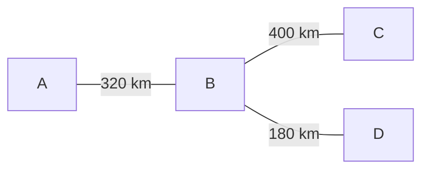

# Design and Analysis of a Four-Node Long-Haul WDM Optical Network

## 1. Project Overview

This project presents a system-level design and simulation of a four-node long-haul optical network. The goal is to satisfy a given traffic demand while completing routing and wavelength assignment, optical power-budget analysis, commercial component selection, and system-level performance validation under predefined design constraints.

The network uses 10 Gb/s and 40 Gb/s OOK channels over a wavelength-division multiplexed optical infrastructure. The simulation evaluates key system metrics including optical power, EDFA performance, ASE noise and optical SNR, nonlinear phase accumulation, and chromatic dispersion compensation.
---

## 2. Network Topology
The network consists of four nodes representing four cities. Node B serves as the central transit node. The physical topology is a tree structure, where all traffic between A/C/D that is not directly terminated at B must pass through node B.

Each physical connection is modeled as a bidirectional fiber pair. The link lengths are:
- A–B: 320 km
- B–C: 400 km
- B–D: 180 km



## 3. Traffic and Design Requirements

### Traffic Matrix
| From \ To(Gbps) |  A |  B |  C |  D |
| --------- | -: | -: | -: | -: |
| A         |  — | 60 | 50 | 50 |
| B         | 70 |  — | 30 | 20 |
| C         | 30 | 50 |  — | 30 |
| D         | 20 | 30 | 60 |  — |


### Key Constraints
## Commercial Components

| Component | Manufacturer / Model | Key Specifications | Role |
|---|---|---|---|
| Laser | Box Optronics DWDM DFB Butterfly Laser | CW, 2 mW output, 1528.77–1610.06 nm, ITU DWDM grid | Optical carrier source |
| 10G Modulator | Exail MX-LN-10 | LiNbO3 Mach-Zehnder intensity modulator, 10 GHz, 3.5 dB design insertion loss | 10 Gb/s OOK modulation |
| 40G Modulator | Exail MX-LN-40 | LiNbO3 Mach-Zehnder intensity modulator, 40 GHz, 3.5 dB design insertion loss | 40 Gb/s OOK modulation |
| Optical Fiber |Corning F-SMF-28 | 0.20 dB/km attenuation, 18 ps/(nm·km) dispersion, γ = 1.43 W⁻¹km⁻¹ | Long-haul transmission medium |
| EDFA | FS #35924 FMT-LA | 15–33 dB gain, 4.5 dB nominal NF, −30 to +5 dBm input range, 1528–1564 nm | Inline optical amplification |
| DWDM MUX/DEMUX | FS #26569 | 16 channels, C27–C42, 100 GHz spacing, 4.6 dB insertion loss | Wavelength multiplexing / demultiplexing |
| 10G Receiver | Thorlabs DX30AF | 30 GHz bandwidth, 0.75 A/W responsivity, 750–1650 nm | 10 Gb/s optical detection |
| 40G Receiver | Thorlabs DX50AF | 50 GHz bandwidth, 0.70 A/W responsivity, 1250–1650 nm | 40 Gb/s optical detection |
| Long-Span DCM | Proximion DCM-HDC | Chirped FBG, 300–600 km G.652 compensation range, 3.7 dB insertion loss | Long-span chromatic dispersion compensation |
| Standard-Span DCM | Proximion DCM-CB | Chirped FBG, 10–140 km G.652 compensation range, 3.7 dB insertion loss | Shorter-span chromatic dispersion compensation |

## 4. Routing and Wavelength Assignment

The traffic demand between each source-destination pair is decomposed into 10 Gb/s and 40 Gb/s OOK channels using a **40G-first allocation strategy** to reduce the total number of wavelength channels.

The wavelength assignment follows the following rules:
- **Wavelength continuity:** A transit channel keeps the same wavelength across node B. No wavelength conversion or O/E/O regeneration is assumed at the transit node.
- **No same-link conflict:** Two simultaneously active channels cannot use the same wavelength on the same directed fiber.
- **Spatial wavelength reuse:** The same logical wavelength may be reused on different directed fibers when the corresponding optical paths do not conflict.
- **Directional independence:** Opposite transmission directions are modeled on separate fibers, allowing wavelength resources to be assigned independently in each direction.

The final allocation is summarized below.

| Demand | Traffic | Channel Decomposition | Route     |
| ------ | ------: | --------------------- | --------- |
| A → B  | 60 Gb/s | 40 + 10 + 10          | A-B       |
| A → C  | 50 Gb/s | 40 + 10               | A-B | B-C |
| A → D  | 50 Gb/s | 40 + 10               | A-B | B-D |
| B → A  | 70 Gb/s | 40 + 10 + 10 + 10     | B-A       |
| B → C  | 30 Gb/s | 10 + 10 + 10          | B-C       |
| B → D  | 20 Gb/s | 10 + 10               | B-D       |
| C → A  | 30 Gb/s | 10 + 10 + 10          | C-B | B-A |
| C → B  | 50 Gb/s | 40 + 10               | C-B       |
| C → D  | 30 Gb/s | 10 + 10 + 10          | C-B | B-D |
| D → A  | 20 Gb/s | 10 + 10               | D-B | B-A |
| D → B  | 30 Gb/s | 10 + 10 + 10          | D-B       |
| D → C  | 60 Gb/s | 40 + 10 + 10          | D-B | B-C |

### Allocation Summary

The final traffic decomposition and wavelength assignment produce:

| Item | Result |
|---|---:|
| Source-destination demands | 12 |
| Wavelength-channel instances | 32 |
| Logical wavelengths required | 9 |
| Maximum channels on one directed fiber | 9 |
| Supported channel rates | 10 Gb/s and 40 Gb/s |

A total of **32 wavelength-channel instances** are required to carry all traffic demands. Through spatial wavelength reuse, only **9 logical wavelengths** are required across the complete network.

The complete channel-level routing and wavelength allocation is available in:

[`data/wavelength_allocation.csv`](data/wavelength_allocation.csv)

## 5. System Architecture and Component Selection

All major optical components in this design are selected from commercially available products. Component selection is based on the operating wavelength range, supported data rate, insertion loss, optical power limits, amplifier gain range, and dispersion-compensation requirements of the network.

The selected devices are integrated into the system-level simulation using their nominal or design parameters obtained from manufacturer specifications.

| Component | Selected Device | Key Role |
|---|---|---|
| Laser | Box Optronics DWDM DFB Butterfly Laser | DWDM optical carrier source |
| 10G MZM | Exail MX-LN-10 | 10 Gb/s OOK modulation |
| 40G MZM | Exail MX-LN-40 | 40 Gb/s OOK modulation |
| Optical Fiber | Corning F-SMF-28 | Long-haul single-mode transmission |
| EDFA | FS #35924 FMT-LA | Inline optical amplification |
| MUX/DEMUX | FS #26569 | 16-channel, 100 GHz DWDM multiplexing |
| 10G Receiver | Thorlabs DX30AF | 10 Gb/s optical detection |
| 40G Receiver | Thorlabs DX50AF | 40 Gb/s optical detection |
| Long-Span DCM | Proximion DCM-HDC | Long-span chromatic dispersion compensation |
| Standard-Span DCM | Proximion DCM-CB | Shorter-span chromatic dispersion compensation |

Detailed component parameters used in the simulation are stored in
[`data/Components.json`](data/Components.json).


## 6. Simulation Methodology
The simulation was developed and validated incrementally. Individual
propagation models were first tested on a representative multi-link route
(A–B–C) to verify the power, noise, nonlinear, and dispersion calculations.
After the link-level behavior was validated, the same modular analysis was
extended to all 32 wavelength-channel instances in the network.

For each channel, the simulation follows its assigned physical route and
evaluates the optical power evolution, cascaded ASE noise, optical SNR,
SPM nonlinear phase, and chromatic dispersion. Network-level checks, such as
aggregate WDM input power at each active EDFA site, are then performed after
all channels have been simulated.

### 6.1 Power Budget
说明：
- fiber attenuation
- MZM/MUX/DEMUX insertion loss
- EDFA gain
- DCM insertion loss
- endpoint EDFA bypass for DROP channels
- passive leveling for transit channels

### 6.2 ASE Noise and Optical SNR
说明：
- ASE is accumulated stage by stage
- existing ASE is attenuated/amplified together with the signal path
- each EDFA generates additional ASE
- optical SNR = signal / accumulated ASE

### 6.3 Nonlinear Phase
说明：
- per-channel SPM
- effective length
- total nonlinear phase accumulated over route

### 6.4 Chromatic Dispersion
说明：
- uncompensated dispersion
- commercial DCM compensation
- residual dispersion and pulse broadening

---

## 7. Key Results

| Metric | Result |
|---|---|
| Total channels | 32 |
| Power-limit validation | 32 / 32 PASS |
| Power leveling | 32 / 32 PASS |
| Optical SNR | 32 / 32 PASS |
| SPM | 32 / 32 PASS |
| Active EDFA input | 19 / 19 PASS |
| Worst optical SNR | 13.71 dB |
| Max nonlinear phase | 1.074 rad |
| Nominal residual dispersion | 0 ps/nm |

**Selected output figures are shown below.**
### Optical SNR by Channel


The dashed line represents the minimum optical SNR requirement of 13 dB.

### Worst-Case Channel Power Profile


The power profile shows the evolution of the worst-case 40 Gb/s channel (`ch06`, A–B–D) through fiber spans, DCMs, EDFAs, and the transit node.

### Aggregate EDFA Input Power


The aggregate WDM input power at all 19 active EDFA sites remains within the specified EDFA input-power range.

### SPM Nonlinear Phase


All wavelength channels remain below the nonlinear phase limit of π radians.

## 8. Repository Structure

```text
.
├── data/
│   ├── Components.json
│   ├── Network.json
│   ├── design_constraint.json
│   ├── dispersion_compensation.json
│   └── wavelength_allocation.csv

├── src/
│   ├── power_budget.py
│   ├── gain_selection.py
│   ├── ase_snr.py
│   ├── nonlinearity.py
│   ├── dispersion.py
│   └── plotting.py
├── results/
│   └── figures/
├── main.py
└── README.md
```
## NOTICE
This project was originally developed as a course project and was later refactored and extended into a modular Python-based optical network simulation.

Some commercial components and design parameters have been updated or replaced during the refactoring process to improve consistency with the system requirements and currently available product specifications. Unless otherwise stated, component parameters used in the simulation are based on nominal or datasheet values rather than hardware measurements.

The project is intended for system-level design and simulation rather than production deployment.